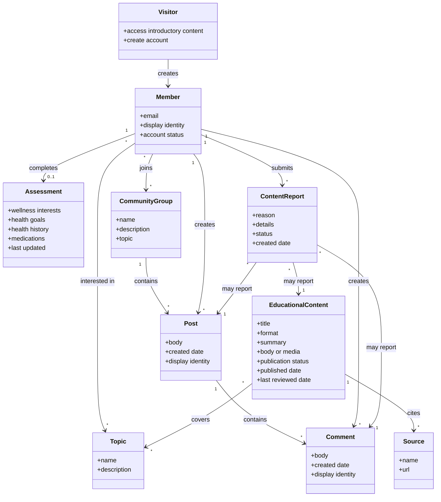

# Software Requirements Specification

**Project:** Well Live
**Team:** Elijah Johnston, An Cao, Esteban Hernandez-Anguiano, Nikola Koltin, William Schuller, Angelette Munoz
**Client:** Sarah Becan
**Version:** 0.1

---

_**How to use this template.** Instructions appear in italic square brackets. Fill in underneath them and leave them in place until the document is stable._

_**What this document is, and what it is not.** The specification describes the external behavior of your system completely enough that a developer can build it and a tester can check it. What it is **not** is a container for everything you have written. Your glossary, vision and scope, use cases, and business rules are separate documents with their own identifiers, and this one **links to them rather than repeating them**._

_That makes the specification mostly a hub. Read that as a feature. One fact, one home: a business rule copied in here is a business rule that will disagree with `business-rules.md` by October, and nobody will notice which copy is right. The sections below that say "link to" are supposed to be short._

_What this document owns outright: the requirements that have no other home. Functional requirements that are not part of any use case, quality attributes, external interfaces, data requirements, operating environment, and constraints._

## Identifiers

_Every requirement in this document carries a name-based slug. Create only the spaces your project actually needs._

| Space | For | Example |
|---|---|---|
| `FR-<AREA>-<slug>` | Functional requirements outside any use case | `FR-SAVE-autosave-active` |
| `UI-<slug>` | User interface requirements | `UI-spa-views` |
| `SI-<slug>` | Software and system interfaces | `SI-llm-proxy-only` |
| `CI-<slug>` | Communications interfaces | `CI-email-notifications` |
| `DI-<slug>` | Data requirements | `DI-persist-graph` |
| `OE-<slug>` | Operating environment | `OE-supported-browsers` |
| `CO-<slug>` | Design and implementation constraints | `CO-single-application` |
| `AS-<slug>` / `DE-<slug>` | Assumptions and dependencies | `AS-supported-browser`, `DE-llm-service` |

_Quality attributes get one space per attribute, so the identifier says which kind of quality it is at the place it is cited: `USE-` usability, `PER-` performance, `SEC-` security, `SAF-` safety, `AVL-` availability, `ROB-` robustness, `SCA-` scalability, `INT-` interoperability, `MNT-` maintainability._

_Requirements cited from elsewhere keep their own identifiers: `UC-*` from [use-cases.md](use-cases.md), `BR-*` from [business-rules.md](business-rules.md), `BO-*`, `SM-*`, `FEAT-*` from [vision-and-scope.md](vision-and-scope.md)._

## Revision History

| Date | Version | Description | Author |
|---|---|---|---|
| 2026-09-26 | 0.1 | Initial draft | Well Live team |

---

## 1. Introduction

### 1.1 The purpose of Well Live

_[What the system is for: who wants it, why, and who will use it. Even though the vision and scope answers this, restate it in a paragraph here, because people read this document without having read that one.]_

Well Live is a subscription-based health and wellness platform that provides members with trustworthy educational content, personalized wellness information, and peer support. The system is intended for people and families seeking understandable health information and a judgment-free community. Well Live will organize evidence-based articles, videos, podcasts, and other educational materials around wellness topics such as nutrition, fitness, financial health, mental health, and general health. The system will present health information as education and support, not as medical diagnosis, treatment, or professional medical advice.

### 1.2 The purpose of this document

_[What this specification covers and for which release.]_

This document describes the functional, data, interface, environmental, and quality requirements for the initial Well Live release. It serves as the primary reference for what the system must do and how the system should behave. The document is intended for the Well Live development team, client, testers, moderators, administrators, and future maintainers.

The MVP focuses on account and profile management, the health and wellness assessment, and browsing general educational content. Community discussions, subscriptions, administration, moderation, and advanced personalization may be implemented in later releases unless the scope is changed by the client.

### 1.3 Document conventions

_[Any typographical conventions, and the identifier formats above, so that someone adding a requirement later knows how to name it.]_

This document uses the following conventions:

- Requirements use the word **shall** to indicate a mandatory requirement.
- The word **should** indicates a recommended behavior.
- The word **may** indicates an optional behavior.
- Functional requirements outside a use case use the format `FR-<area>-<slug>`.
- User interface requirements use the format `UI-<slug>`.
- Software interface requirements use the format `SI-<slug>`.
- Communications interface requirements use the format `CI-<slug>`.
- Data requirements use the format `DI-<slug>`.
- Operating environment requirements use the format `OE-<slug>`.
- Design constraints use the format `CO-<slug>`.
- Assumptions and dependencies use the formats `AS-<slug>` and `DE-<slug>`.
- Quality requirements use prefixes such as `USE-`, `PER-`, `SEC-`, `AVL-`, `ROB-`, `SCA-`, `INT-`, and `MNT-`.
- Use cases retain their identifiers from `use-cases.md`, such as `UC-ACC-create-account`.
- Business rules retain their identifiers from `business-rules.md`, such as `BR-content-review`.

### 1.4 References

_[Every document this specification refers to, with a link. At minimum, the four other documents in this folder. Include external standards you must conform to.]_

- [Project Glossary](project-glossary.md)
- [Vision and Scope](vision-and-scope.md)
- [Use Cases](use-cases.md)
- [Business Rules](business-rules.md)
- [Open Issues](OPEN-ISSUES.md)
- [The Easy Approach to Requirements Syntax (EARS)](https://alistairmavin.com/ears/)

---

## 2. Overall Description

### 2.1 Product perspective

_[How this system relates to other systems and to the user's environment. Self-contained, or one component of something larger? Link to the product perspective section of your vision and scope and to your architecture's context diagram rather than redrawing them.]_

**Review this**

Well Live is a new web-based health and wellness platform. It is not replacing an existing internal system. Users will access the system through a responsive web application, and mobile support may be added or expanded as the product is validated.

The system will include account management, member profiles, health and wellness assessments, educational content, and community features. It will depend on external services for authentication, database storage, media storage, and future subscription payments.

The major external systems are:

- Authentication service
- Relational database
- Object or media storage
- Payment provider for a future subscription release
- External content hosts for linked videos, podcasts, or articles

### 2.2 User classes and characteristics

_[The kinds of user, and what distinguishes them: frequency of use, technical skill, privilege level, whether they are inside or outside the client's organization. Link to the stakeholder profiles in your vision and scope; what belongs here is what affects the software's behavior, especially permissions.]_

The primary user classes are:

- **Visitor:** A person who can access introductory information and create an account. Visitors do not have access to member-only functionality.
- **Member:** A signed-in user who can complete an assessment, browse educational content, and eventually participate in community discussions.
- **Moderator:** A user responsible for reviewing reports and removing harmful, misleading, abusive, or unsafe content. This role is not part of the initial MVP.
- **Health professional or content reviewer:** A person who reviews educational material for accuracy and credibility. The exact responsibilities of this role are still subject to client confirmation.
- **Administrator:** A user responsible for managing accounts, content, categories, and platform settings. This role is planned for a later release.
- **Client or founder:** Sarah Becan, who provides product direction, validates requirements, and approves major changes in scope.

Members may have a wide range of technical skills. The system should therefore use plain language, clear navigation, readable content, and accessible controls.

### 2.3 Operating environment

_[The environment the software runs in: hardware, operating systems and versions, browsers, where users and servers are located, and any other software it has to coexist with.]_

_Examples:_

- _`OE-supported-browsers`: The system shall operate correctly on the current and previous major versions of Chrome, Firefox, Safari, and Edge._
- _`OE-server-platform`: The system shall run on a server running the current corporate-approved version of Linux._
- _`OE-access-paths`: The system shall permit access from the corporate intranet, from a VPN connection, and from Android and iOS phones and tablets._

- `OE-supported-browsers`: The system shall operate on current versions of Chrome, Firefox, Safari, and Edge.
- `OE-responsive-web`: The user interface shall be usable on desktop, tablet, and mobile browser screen sizes.
- `OE-internet-access`: Users shall access the system through an internet connection.
- `OE-hosted-server`: The application shall run on hosted server infrastructure.
- `OE-database-storage`: Application data shall be stored in a managed relational database.
- `OE-media-storage`: Educational media and uploaded files, if supported, shall be stored using protected object storage.
- `OE-secure-connections`: Connections between users, the application, and external services shall use secure network connections.

### 2.4 Design and implementation constraints

_[Anything that limits the developers' options: corporate or regulatory policy, hardware limits, required languages or databases, coding standards, interfaces to other applications.]_

_Examples:_

- _`CO-database-engine`: The system shall use the corporate standard database engine._
- _`CO-language-version`: The backend shall be written in Java 21._
- _`CO-coding-standard`: Design, code, and maintenance documentation shall conform to the client's development standard._

_The constraint students forget: **who maintains this after you graduate, and what do they already know how to run?** If the answer is one person who knows Python, a Spring Boot service is a constraint violation nobody wrote down._

- `CO-responsive-application`: The MVP shall be implemented as a responsive web application.
- `CO-single-application`: The MVP shall focus on one Well Live application rather than separate applications for different user classes.
- `CO-standard-services`: The system shall use standard authentication, database, storage, and payment services rather than custom replacements.
- `CO-health-boundary`: The system shall present content as health education and self-care support, not as diagnosis, treatment, or emergency medical care.
- `CO-human-content-review`: Educational content shall be reviewed according to the client-approved content review process before publication.
- `CO-maintainable-code`: The implementation shall be organized so that future student teams or maintainers can understand and update it.

### 2.5 Assumptions and dependencies

_[An assumption is a factor you believe true without proof, which would change these requirements if it turned out false. A dependency is something outside your control that the project relies on: an external API, a third-party library, a change someone else has to make.]_

- `AS-user-internet-access`: Users have access to a modern web browser and an internet connection.
- `AS-client-content-approval`: The client will approve the educational topics, content sources, and content review process.
- `AS-assessment-voluntary`: Members will not be required to disclose sensitive health information unless the client explicitly approves that requirement.
- `AS-app-store-clearance`: The platform will be treated as a wellness and education platform rather than a medical device or telehealth service.
- `AS-continuous-maintenance`: Hosting, security updates, and operational maintenance will be available after the student team completes the project.
- `DE-authentication-service`: Account creation and sign-in depend on an authentication service.
- `DE-database-service`: The application depends on a relational database for account, profile, assessment, and content data.
- `DE-media-storage`: The application depends on protected storage for media files and other content assets.
- `DE-payment-provider`: Subscription functionality depends on an approved payment provider and is outside the initial MVP.
- `DE-content-reviewers`: Publishing reviewed educational content depends on the availability of qualified reviewers.

---

## 3. Project Glossary

_[Link only. The glossary is [project-glossary.md](project-glossary.md).]_

The definitions used by this specification are maintained in the [Project Glossary](project-glossary.md).

## 4. Vision and Scope

_[Link only. Business requirements, objectives, metrics, and scope live in [vision-and-scope.md](vision-and-scope.md).]_

---

## 5. Functional Requirements

### 5.1 Use cases

_[Link to [use-cases.md](use-cases.md). Most of your system's behavior is specified there, as use cases, and it does not get restated here.]_

Most user-visible behavior is specified in [Use Cases](use-cases.md). The use cases define the actors, preconditions, main success scenarios, extensions, associated information, and business rules for each user goal.

The primary MVP use cases are:

- `UC-ACC-create-account`: Create an account
- `UC-ACC-sign-in`: Sign in
- `UC-ACC-complete-assessment`: Complete the health and wellness assessment
- `UC-ACC-update-assessment`: Update assessment answers
- `UC-ACC-delete-account`: Delete an account and personal data
- `UC-CON-browse-feed`: Browse the educational feed
- `UC-CON-search-content`: Search or filter educational content
- `UC-CON-read-content`: Read educational content and its sources

### 5.2 Non-use-case functional requirements

_[Behavior that is real, testable, and belongs to no single use case: autosave, validation applied everywhere, notification, authorization, audit logging. If you find yourself writing the same step into six use cases, it belongs here instead._

_Group them under sub-headings by concern, and write each one using an [EARS](https://alistairmavin.com/ears/) shape so that it cannot be read two ways:_

- _**Ubiquitous:** The `<system>` shall `<response>`._
- _**Event driven:** When `<trigger>`, the `<system>` shall `<response>`._
- _**State driven:** While `<in a state>`, the `<system>` shall `<response>`._
- _**Optional:** Where `<feature is included>`, the `<system>` shall `<response>`._
- _**Unwanted behavior:** If `<precondition>`, then the `<system>` shall `<response>`._

_Example: `FR-SAVE-autosave-active`: While a student is editing a weekly activity report during an active week, the system shall persist the draft every 30 seconds._

_**Every requirement here needs an oracle.** If you cannot say how a tester would tell whether it holds, it is not a requirement yet.]_

---

## 6. Business Rules

_[Link only, to [business-rules.md](business-rules.md). Business rules are a rich source of requirements because they dictate properties the system must have in order to conform to them, but the rules themselves are properties of the client's business, not of your software, and they have their own document.]_

The business rules governing Well Live are maintained in [Business Rules](business-rules.md).

---

## 7. Data Requirements

### 7.1 Business domain model

_[The entities in the problem domain and how they relate, as a mermaid class diagram. Model the **business**, not your database schema: this is what the client would recognize, before any decision about tables or persistence.]_

The following entities represent the major business concepts in Well Live. They describe what the client and users recognize, rather than the technical database tables.

### 7.2 Data dictionary

_[Each entity's fields, with data type, allowed values, defaults, and validation rules. Where a use case already specifies a field's validation in its Associated Information, cite the use case instead of repeating it.]_

**Might go back and change this** 
**Don't know if I did this right**

| Entity | Field | Type | Required? | Validation or allowed values | Access concerns |
|---|---|---|---|---|---|
| Member | member ID | UUID/String | Yes | System-generated and unique | Internal use |
| Member | email | String | Yes | Valid email format and unique | Visible only to the member and authorized administrators |
| Member | password hash | String | Yes | Stored as a salted hash; never displayed | Never shown or logged |
| Member | account status | Enum | Yes | Active, disabled, pending deletion, deleted | Internal use |
| Member | display mode | Enum | Yes | Anonymous or named | Controlled by the member |
| Member | display name | String | Conditional | Required when named; length and uniqueness rules TBD | Visible to community members |
| Assessment | wellness interests | Set of Topic | No | Values must come from the approved topic list | Member only |
| Assessment | health goals | Set/Text | No | Approved choices and optional “Other” text | Sensitive; member only |
| Assessment | health history | Set/Text | No | Approved choices and optional “Other” text | Sensitive; encrypted and member only |
| Assessment | medications | Set/Text | No | Approved choices and optional “Other” text | Sensitive; encrypted and member only |
| Assessment | personalization enabled | Boolean | Yes | True or false | Controlled by the member |
| EducationalContent | title | String | Yes | Must not be empty | Visible to members when published |
| EducationalContent | topic | Topic | Yes | Must use an approved topic | Visible to members |
| EducationalContent | format | Enum | Yes | Article, video, podcast, diagram, or approved future format | Visible to members |
| EducationalContent | summary | Text | Yes | Length limit TBD | Visible to members |
| EducationalContent | publication status | Enum | Yes | Draft, review, published, unpublished | Controls visibility |
| EducationalContent | source | Source | Yes | At least one source required | Visible to members |
| EducationalContent | last reviewed date | Date | Yes | Valid date | Visible to members |
| CommunityGroup | name | String | Yes | Unique within the platform | Visible to members |
| Post | body | Text | Yes | Cannot be empty; maximum length TBD | Visible according to group access |
| Comment | body | Text | Yes | Cannot be empty; maximum length TBD | Visible according to group access |
| ContentReport | reason | Enum | Yes | Harmful/unsafe, bullying/harassment, misinformation, or other | Visible to moderators |
| ContentReport | details | Text | No | Maximum length TBD | Visible to moderators |
| ContentReport | status | Enum | Yes | Open, under review, resolved | Visible to moderators |

### 7.3 Reports

_[Any report the system generates: who reads it, what it contains, how often, and in what format. Reports are where clients discover late that a field they need was never captured, so specify them early.]_

The MVP does not currently define a formal business report. The system may provide administrative or moderation views in a later release.

Potential future reports include:

- Content moderation queue
- Report resolution summary
- Member account and access summary
- Educational content publication and review status
- Feed usage and content engagement summary

Each report must be reviewed with the client before implementation. The required audience, fields, filters, frequency, and export format are currently TBD.

### 7.4 Data acquisition, integrity, retention, and disposal

_[Where the data comes from, how it is kept correct, how long it is kept, and how it is destroyed. If your system holds anything about students or other identifiable people, this section is not optional, and its content is usually a business rule you should cite rather than invent.]_

#### Data acquisition

- Account data is entered by the visitor or member during account creation.
- Assessment data is entered voluntarily by the member.
- Educational content is entered or imported by authorized content contributors or administrators.
- Educational content sources are provided by the content team and approved according to the content review process.
- Community posts and comments are entered by members in later releases.

#### Data integrity

- Required fields shall be validated before being saved.
- Email addresses shall be stored uniquely for each active account.
- Assessment updates shall be saved as all-or-nothing transactions.
- Only published educational content shall be displayed to members.
- Content reports shall maintain a record of the reported item, reporting member, reason, status, and resolution.

#### Data protection

- Sensitive assessment information shall be protected by access control.
- Sensitive information shall be encrypted at rest and in transit.
- Assessment information shall not be displayed on public profiles or to other members.
- Application logs shall not contain passwords or unnecessary sensitive health information.

#### Retention

The final retention period for account data, assessment data, community content, reports, and audit records is TBD and must be approved by the client before production deployment. The system shall be designed so that retention periods can be applied consistently to each data category.

#### Disposal

When a member deletes an account, the system shall disable future sign-in, delete or anonymize personal information according to the approved deletion policy, and remove assessment data according to the approved retention requirements. The deletion process shall not leave the account partially usable.

---

## 8. External Interface Requirements

### 8.1 User interfaces

The user interface will be simple, readable, and usable on common desktop and mobile browsers.

### 8.2 Hardware interfaces

The system does not require custom hardware. It runs on standard user devices with internet access and on hosted server infrastructure for the application, database, and media storage.

### 8.3 Software interfaces

The application shall integrate with a standard authentication service, a relational database, object storage for media files, and an approved payment provider for subscriptions. If an external dependency is unavailable, the system will notify the user. 
### 8.4 API document

No formal API document exists yet. As implementation begins, the team shall create and maintain an API specification that lists endpoints, authentication requirements, and request/response formats.

### 8.5 Communications interfaces

The system should use HTTPS for browser-to-server communication and secure connections to backend services. It may also send account, moderation, or subscription notifications by email or in-app messaging.

---

## 9. Quality Attributes

### 9.1 Usability

`USE-responsive-ui`: All major screens shall be usable on common desktop and mobile browsers and shall be easy to read and navigate.

### 9.2 Performance

`PER-feed-load`: A typical user shall be able to open the main content feed in under 3 seconds on a standard broadband connection.

### 9.3 Security

`SEC-protected-data`: Sensitive health and profile information shall be protected by access control, encryption, and secure storage, and only authorized users shall be able to view it.

### 9.4 Safety

`SAF-moderation`: The system shall support human moderation and review of health-related content to reduce the risk of harmful or false medical guidance.

### 9.5 Availability

`AVL-uptime`: The application shall be available at least 99% of the time outside scheduled maintenance windows.

### 9.6 Robustness

`ROB-data-preservation`: User profile changes and content submissions shall be saved reliably so that brief network interruptions do not cause major data loss.

### 9.7 Scalability, interoperability, maintainability

`SCA-growth`: The architecture shall support growth in users, content, and moderator activity without requiring a major redesign.

`INT-standard-integration`: The system shall integrate with standard authentication, database, storage, and payment services.

`MNT-maintainability`: The system shall be organized so that future team members can update content, profiles, and moderation workflows without large rework.

---

## 10. Internationalization and Localization

The MVP is intended for a single English-language deployment. Time zone, currency, and locale support are not required for the initial release, but the system should be structured so these can be added later if the product expands.

---

## 11. Other Requirements

- The product shall undergo privacy and compliance review before handling real health information.
- Moderators and administrators shall receive training on content approval, community reporting, and account management.
- The long-term maintainer, hosting owner, and operating budget shall be identified before full deployment.
- The platform shall use evidence-based content and human review to reduce misinformation and protect user safety.
- The MVP shall not include fully real-time chat or advanced AI-generated medical advice features.

---

## Working this document with your agent

_[Delegate: converting prose requirements into EARS shapes; checking that every `UC-*`, `BR-*`, and `FEAT-*` cited here exists in the document that owns it; finding functional requirements that appear in several use cases and should be lifted into section 5.2; drafting an oracle for a quality attribute you have stated only as an adjective._

_Keep human: the numbers. Every threshold in section 9 is a commitment somebody has to live with, and an agent will supply a plausible one (99.9% uptime, 200ms response) that nobody asked for and no one can meet. A number in this document either came from your client, from a measurement, or from a decision your team made deliberately and can defend._

_**The specific failure to watch for: invented precision.** A generated specification reads as authoritative at exactly the points where it is guessing. Check every number, every browser version, every retention period against something real, and put the ones you cannot verify in [OPEN-ISSUES.md](OPEN-ISSUES.md) instead of leaving a confident guess in the document your team will build from.]_
