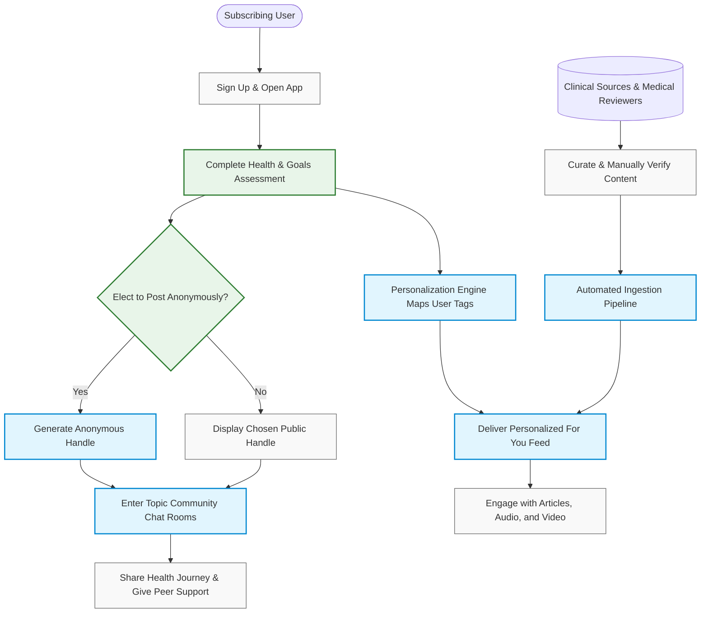
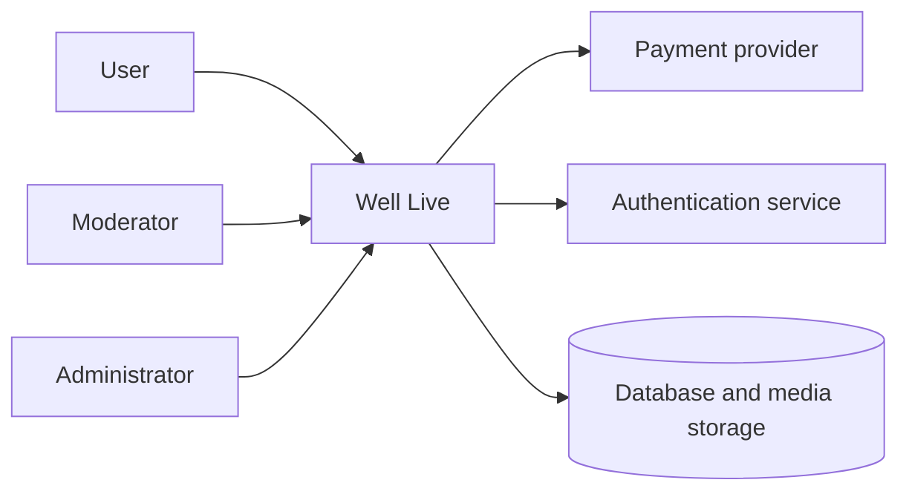

# Vision and Scope

**Project:** _Well Live_
**Team:** An Cao, Esteban Hernandez-Anguiano, Elijah Johnston, Nikola Koltin, William Schuller, Angelette Munoz
**Client:** Sarah Becan
**Version:** 0.1

---

_**How to use this template.** Every section below opens with an instruction in italic square brackets: what the section is for, how to produce it, a worked example, and a checklist. Fill in the section underneath the instruction. **Leave the instructions in the file until the document is stable.** They are context for you, for the teammate who writes a later section, and for your AI teammate, which reads this file every time it works on your project._

_**This document has two readers.** Your client has to recognize their own business in it, so avoid jargon they would not use. Your AI teammate has to build from it, so avoid a claim it cannot check. When the two pull against each other, write for the client and put the precision in the use cases._

_**Work it with your agent, not instead of it.** Give the agent this template, your one-page project brief, and your meeting notes, then put it in a role: "You are an experienced business analyst. Using the instructions in this template, draft section X, and list every question you cannot answer from what I gave you." The questions it cannot answer are the point. They go in [OPEN-ISSUES.md](OPEN-ISSUES.md) and they become the agenda for your next client meeting. What the agent cannot do is decide which of its questions deserve your client's limited time, or tell enthusiasm apart from commitment. That judgment is yours._

## Identifiers in this document

_Identifiers here are **name-based slugs**, never numbers._

| Space | Shape | Example |
|---|---|---|
| Business objective | `BO-<slug>` | `BO-grading-time` |
| Success metric | `SM-<slug>` | `SM-submission-rate` |
| Risk | `RI-<slug>` | `RI-cloud-cost` |
| Assumption or dependency | `AS-<slug>` | `AS-client-maintains-stack` |
| Feature | `FEAT-<slug>` | `FEAT-performance-tracking` |

_Coin each slug from the concept itself: short, kebab-case, unique within its space. **Never renumber, rename, or repoint an identifier.** A new item gets a new slug; a retired item keeps its slug and is marked withdrawn. Cite items by identifier, never by position in a list ("the third objective")._

_Why this matters more with an agent than it used to: ask an agent to insert a new objective into a list numbered `BO-1` through `BO-6` and it has two options. Renumber everything, silently breaking every citation in your use cases and your specification, or append out of order. No test you can write detects either one. A slug has neither failure mode, and it tells a reader what the item is at the place it is cited._

## Revision History

| Date | Version | Description | Author |
|---|---|---|---|
| 2026-09-16 | 0.1 | Initial draft from the client brief and first client meeting | Well Live Team |

---

## 1. Introduction

_[This document defines the goals, purpose, and boundaries of Well Live. It gives every stakeholder a shared understanding of what the software is for and the context it operates in: the business problem being solved, how the software fits into the client's world, and where the line falls between what is in scope and what is not.]_

### 1.1 Background

Well Live is a proposed subscription-based health and wellness application created for people who want trustworthy health information, practical self-care education, and support from a community with similar experiences. The product is intended to combine familiar social-media features with educational health and wellness content.

The proposed audience includes people with a wide range of health and wellness needs, including individuals managing serious illnesses, families with limited financial resources, and people who want more approachable information about their health. At the moment, Well Live will be for only 18+. The product should not be centered only on highly polished fitness influencers or unrealistic wellness lifestyles. Instead, it should provide an inclusive environment where users can find useful information and support that reflects real-life circumstances.

Well Live is intended to address the gap between information and support available at home, in clinics, and in hospitals. Users should be able to share health-related experiences, participate in discussions, and find educational materials related to topics such as nutrition, fitness, financial wellness, mental health, and spiritual health.

The client’s stated objectives are to:

- Enhance patient health outcomes.
- Make truthful self-care feel approachable and motivating.
- Increase health education and health literacy.
- Engage users in discussions about health and wellness.
- Promote community and engagement.
-Educate users about health topics, devices, and services.

The initial product concept includes personalized content based on a user’s interests, goals, and potentially their health history. It also includes educational content in multiple formats, such as articles, pictures, videos, and podcasts, along with community features such as discussion areas and a chat room for social support.

The project must balance usefulness and personalization with credibility, privacy, security, accessibility, and user safety. Health information should be presented as education and support rather than as a diagnosis, prescription, or replacement for professional medical care. The exact health information collected, the role of medical review, the subscription model, and the level of community moderation remain open questions for discussion with the client.

### 1.2 Current Process Flows (As-Is Process Flows)

_[Most projects require everyone involved to have a firm grasp of the business process being created, replicated, or improved. Without that understanding there is little chance users adopt the new solution. Process flows are the most effective model for building it.]_

_**Step 1: Diagram the current process.** Draw the process people execute **today**, before your software exists, as a mermaid flowchart with **one subgraph per actor** (roles, departments, existing systems). Show the sequence of activities, the decision points, and the handoffs between actors._

_Diagrams in this project are authored as mermaid inside the Markdown file, never exported from a drawing tool as an image. A picture of a diagram is invisible to your AI teammate and unreadable in a diff; a mermaid block is text it can read and revise. A skeleton to start from:_

flowchart TD
  subgraph User["Person seeking health and wellness information"]
    A[Recognize a health or wellness question] --> B[Search the internet or social media]
    B --> C[Review articles, videos, podcasts, posts, or discussions]
    C --> D{Information appears useful and trustworthy?}
    D -- No --> B
    D -- Yes --> E[Save, remember, or share the information]
    E --> F[Apply information to personal self-care or discuss it with others]
  end

  subgraph ExistingSources["Existing websites and social platforms"]
    G[Publish health articles, videos, podcasts, or social posts]
    H[Host comments, groups, or informal discussions]
  end

  subgraph PersonalNetwork["Friends, family, or personal networks"]
    I[Share personal experiences]
    J[Offer informal advice or emotional support]
  end

  B --> G
  B --> H
  C --> I
  C --> J
  I --> F
  J --> F

Currently, a person seeking health and wellness information may begin with a question, concern, or personal goal. They may search across general websites, social-media platforms, video services, podcasts, online communities, or conversations with friends and family. The person must decide for themselves whether the information is trustworthy, relevant, understandable, and appropriate for their situation.

People may also share their own experiences or ask for support through existing social platforms. These platforms can make discussion easy, but they are not necessarily designed specifically for health education. Educational material and personal opinions may appear together, making it difficult for users to distinguish evidence-based information from unsupported claims.

The current process does not provide one confirmed location where users can:

- find health education organized around their interests and goals;
- distinguish educational material from personal opinion;
- review the source or credibility of health information;
- participate in a health-focused community;
- receive content in several formats;
- control how personal information affects content recommendations; or
- report and receive a response to harmful or misleading health content.

Current tools and limitations
- Current tool or source: General internet search engines | Current Use: Locate health and wellness information | Limitation: Results vary in quality, may be difficult to evaluate, and are not necessarily personalized. |
- Current tool or source: Social-media platforms | Current use: Share experiences and participate in discussions | Limitation: Health information, personal opinions, advertising, and misinformation may appear together. |
- Current tool or source: Video and podcast platforms | Current use: Consume educational or motivational content | Limitation: Content may not be reviewed for accuracy, accessibility, or suitability for the user. |
- Current tool or source: Online health communities | Current use: Ask questions and receive peer support | Limitation: Moderation standards and the reliability of advice vary by community. |
- Current tool or source: Friends, family, and personal networks | Current use: Receive informal support and personal experiences | Limitation: Advice may be incomplete, inaccurate, or unsuitable for a person’s health situation. |
- Current tool or source: Clinics and hospitals | Current use: Receive professional health information and care | Limitation: Access may be limited by appointment availability, location, cost, or the user’s ability to ask questions during a visit. |

Current pain points
The current process creates several problems:

- Users must search across multiple websites and platforms instead of finding education and support in one health-focused environment.
- It can be difficult to determine whether information is evidence-based, current, or appropriate for a particular user.
- People may encounter health claims, body-image messages, or self-care advice that does not reflect their financial situation, culture, age, or medical circumstances.
- Personal experiences and professional health education may be mixed together without clearly identifying the difference.
- Users who need emotional or social support may have to use general-purpose platforms that were not designed around health-related safety and moderation.
- People may not have an easy way to report dangerous, misleading, abusive, or privacy-violating content.
- Health education may not be equally accessible to users who prefer articles, images, videos, podcasts, or other formats.
- Collecting health history, medication information, and personal goals without clear privacy rules could create additional risks.

Well Live is intended to improve this situation by providing a more organized health and wellness environment that combines educational content, community participation, and personalized discovery. However, the client must confirm which existing tools and processes are most important to replace or improve before the MVP scope is finalized.

*_Time example: "Printing and distributing delivery schedules to drivers takes 2 hours daily, cutting into time available for deliveries."_

**_**Step 5: Write for an outsider.** Assume your reader knows nothing about this domain. Define every domain term on first use and add it to the [project glossary](project-glossary.md)._

**_**Checklist:** Is the business context clear to someone unfamiliar with it? Does the floteew give step-by-step detail? Are all actors and tools described? Are the inefficiencies illustrated with specific examples? Is there a mermaid diagram with one subgraph per actor?]_

### 1.3 References

- Well Live Project Brief by Sarah Becan | Date: 09-01-2026 | Defines the initial product vision, target audience, objectives, proposed implementation activities, and major capabilities. | Location: Provided by the client and included in the project requirements materials. |
- Well Live Pitch Summary | Date: Current Repository version at the time of drafting | Summarizes the project brief, candidate user classes, possible MVP scope, quality and safety concerns, open risks, and client questions. | Location: docs/well-live-pitch-summary.md |
- Team Contract Well Live | Date: September 2026 | Defines the team members, communication expectations, decision-making process, Git workflow, review requirements, and responsibilities when using AI tools. | Location: docs/team-contract.md |
- Healthy People 2030 | Date: Specific source and publication date to be confirmed | Identified in the client brief as a research source for understanding current health needs and priorities. | Location: Client/team must confirm the specific Healthy People 2030 objectives or materials to be used. |
- Well Live project repository | Date: Current project repository | Contains the project requirements, planning documents, source materials, and future implementation artifacts. | Location: https://github.com/eggsbenedict287/tcu-cosc-40493-capstone-well-live |

---

## 2. Business Requirements

### 2.1 Business Opportunity or Problem Statement

Most wellness apps are built around gym influencers, unrealistic beauty standards, and unvetted advice. Real people, a mother going through cancer treatments, or a family budgeting on food stamps, are often left out. At the same time, medically accurate health information is stuck behind dry academic papers or scattered across scary, generic internet searches. 

Well Live fills this gap by giving people a relatable, subscription-based community that pairs honest peer support with real, evidence-based education. Members get a space where they can talk to others walking the same road, while getting practical, vetted videos, podcasts, and articles tailored to their actual health needs and life situations. 

### 2.2 Business Objectives

* **`BO-health-literacy`**: Increase member health literacy scores by 25% within 90 days of joining.
* **`BO-retention-rate`**: Keep at least 70% of paid subscribers active after their first 3 months.
* **`BO-peer-engagement`**: Have 60% of active members post or chat in community rooms at least twice a week.
* **`BO-intake-completion`**: Hit an 85% completion rate on the onboarding health and goals assessment.
* **`BO-content-credibility`**: Maintain a 95%+ credibility approval rating on all automated and curated materials, verified by licensed professionals.

### 2.3 Success Metrics

| Metric ID | Indicator | Source | Current Baseline | Target Success | Deadline |
|---|---|---|---|---|---|
| **`SM-onboard-complete`** | New signups finishing the health assessment | App onboarding analytics | 0% (New product) | ≥ 80% completion | 4 weeks post-launch |
| **`SM-active-retention`** | Month-over-month paid renewal rate | Stripe / billing records | 0% (New product) | ≥ 65% monthly renewal | 90 days post-launch |
| **`SM-chat-participation`** | Weekly active users chatting or posting | App database logs | 0% (New product) | ≥ 50% of WAU | 60 days post-launch |
| **`SM-content-trust`** | User rating of content trustworthiness | In-app feedback survey | 0% (Industry avg ~35%) | Avg ≥ 4.2 / 5.0 | End of Q1 post-launch |
| **`SM-search-satisfaction`** | Searches leading to a viewed article or episode | Search query analytics | 0% (New product) | ≥ 70% click-through | 4 weeks post-beta |

### 2.4 Vision Statement

| | |
|---|---|
| **For** | Everyday people and families dealing with real-world health and wellness hurdles |
| **Who** | Need trustworthy medical guidance and judgment-free community without influencer hype |
| **The** *Well Live* | Is a subscription-based health education and community app |
| **That** | Delivers vetted educational media (podcasts, video, reads) and private peer chat rooms matched to your personal health background |
| **Unlike** | Commercial social networks (Instagram, Reddit) and static clinical websites (WebMD) |
| **Our product** | Normalizes truthful, accessible self-care by pairing vetted clinical information with genuine human connection |

### 2.5 Proposed Process Flows (To-Be Process Flows)

 
    
### 2.6 Risks

* **`RI-privacy-breach`**: Sensitive user health conditions and medication records stored in the database could be exposed via insecure API endpoints or misconfigured cloud access, causing legal liabilities and destroying subscriber trust.  
  *(Probability: 0.3, Impact: 9)*  
  *Mitigation:* Isolate medical assessment data from user profile records, enforce role-based access control, encrypt data both at rest and in transit, and offer fully pseudonymous public profiles.
* **`RI-peer-misinformation`**: Users in community rooms might recommend unverified home remedies or dangerous prescription adjustments that vulnerable members follow without consulting a physician.  
  *(Probability: 0.6, Impact: 8)*  
  *Mitigation:* Implement automated keyword filters for high-risk medication terms, display sticky medical disclaimers in all chat rooms, and train community moderators to review flagged conversations quickly.
* **`RI-subscription-churn`**: Subscribers might treat the app as a short-term reference tool, completing their initial educational track and canceling their subscription within 30 days.  
  *(Probability: 0.5, Impact: 7)*  
  *Mitigation:* Continuously publish weekly multi-format media (expert Q&As, podcasts, webinars) across the five core wellness pillars and use automated check-ins to keep peer threads active.
* **`RI-ai-hallucination`**: Automated content scraping tools or support chatbots could retrieve outdated, contextually inappropriate, or unverified health advice from the open web.  
  *(Probability: 0.4, Impact: 9)*  
  *Mitigation:* Restrict AI retrieval pipelines strictly to approved clinical databases (e.g., Healthy People 2030, PubMed, CDC) and require clinical sign-off before publishing new modules to user feeds.

### 2.7 Business Assumptions and Dependencies

* **`AS-intake-disclosure`**: Users are willing to share detailed medical histories, current prescriptions, and personal struggles during initial onboarding if promised anonymity and personalized content.  
  *Impact if false:* We cannot personalize feeds or match chat rooms accurately, forcing a pivot to a generic forum model.
* **`AS-subscription-viability`**: Everyday individuals and low-income families will pay a monthly subscription fee for an ad-free, vetted health space rather than relying entirely on free social media.  
  *Impact if false:* The direct-to-consumer subscription model fails, requiring a shift to employer-sponsored wellness or non-profit grant funding.
* **`AS-clinician-sourcing`**: The business can consistently recruit and retain licensed medical and wellness professionals to review content pipelines and maintain clinical credibility.  
  *Impact if false:* The platform loses its primary differentiator over Reddit and Instagram, eroding member trust.
* **`AS-app-store-clearance`**: Apple and Google review teams will classify the app as a wellness and education platform rather than a regulated medical device or telehealth diagnostic service.  
  *Impact if false:* Distribution will be blocked or delayed until costly legal and regulatory compliance audits are completed.
* **`AS-continuous-maintenance`**: Dedicated engineering resources and operational funding will be permanently available to maintain both client-side apps (iOS/Android) and backend server infrastructure (security patches, API updates, cloud hosting, and database scaling).  
  *Impact if false:* Infrastructure will degrade, mobile OS updates will break core functionality, and unresolved vulnerabilities will risk health data privacy breaches.

---

## 3. Stakeholder Profiles and User Descriptions

_[To build something that meets real needs you have to identify everyone with a stake in the outcome, and confirm that the users are actually represented among them. This section records **who they are and why they care**, not their specific requests, which belong in the use cases.]_

_A stakeholder is not always a user. The person paying for the software, the person who maintains it after you graduate, and the person whose job changes because of it all have a stake and may never log in._

### 3.1 Stakeholder Profiles

_**Draft status:** the roles below are carried over from the candidate user classes in [`well-live-pitch-summary.md`](../well-live-pitch-summary.md). None have been confirmed with Sarah Becan. Attitude, in particular, is a guess dressed up as a table cell until a client meeting says otherwise — see the open issues this section raises._

| Stakeholder | Major value or benefit from this product | Attitude | Major features of interest | Constraints | End user? |
|---|---|---|---|---|---|
| Member | Understandable, evidence-based health and wellness education plus peer support, organized around their own goals, without the polished-influencer aesthetic the pitch explicitly rejects. | Unconfirmed — the pitch names the target member (a mother in cancer treatment, a teenager with body-image concerns, a family on food assistance) but no member has been interviewed. | Personalized content feed, community posts/comments, evidence-based articles, video, and podcasts. | May be reluctant to disclose health history; may have limited time, data connectivity, or digital literacy; some are minors (age policy not yet set). | Yes |
| Content contributor | A channel to reach the target audience with material the client considers evidence-based. | Unconfirmed — the pitch implies this role but never names a person or organization who would fill it. | Authoring workflow, visibility into review/publication status. | Content must clear a review step before publishing (workflow not yet designed); compensation and credentialing are undecided. | Yes, if content authoring is confirmed in scope (`FR` TBD) |
| Moderator | Protects the community and the platform's credibility from harm the client cares about (medical misinformation, harassment). | Likely supportive of the mission, but workload is a real risk: `RI-peer-misinformation` above already names moderators as the mitigation for unverified peer advice. | Report queue, moderation actions (hide/warn/suspend/ban), escalation path. | Unclear if moderators are staff, volunteers, or health professionals; expected report volume is unknown. | Yes |
| Health professional / subject-matter reviewer | Wants harmful or inaccurate content caught before it reaches a vulnerable user; is the clinical sign-off named in `RI-ai-hallucination`'s mitigation above. | Unconfirmed and possibly cautious — reviewing user-adjacent health content carries liability exposure for whoever signs off on it. | Review/approval queue, citation and source display, a correction workflow for content later found wrong. | Time-limited; may require a credentialing or legal agreement with the client before this role can exist at all. | Uncertain — role is a candidate, not yet confirmed by the client |
| Platform administrator | Keeps the platform operating and safe day to day. | Supportive in principle, but nobody has been named to hold this role after the team graduates. | User, content, and moderation management; configuration; audit visibility. | Undetermined who this is post-graduation — a deployment-considerations question (section 4.4), not just a stakeholder-table blank. | Yes |
| Sarah Becan (Founder / Client) | Sees the Well Live vision — bridging home, clinic, and hospital through trustworthy education and peer support — actually built and validated. | Supportive; she is the source of the vision, so treat any daylight between this table and her expectations as the highest-priority open issue. | Brand tone ("truthful self-care," not influencer culture), safety, and credibility — matching the vision statement above. | Not a technical stakeholder — needs plain-language explanations, not implementation detail; a one-semester build timeline. | No, unless she also acts as a platform administrator |

_Open issues this table raises for [`OPEN-ISSUES.md`](OPEN-ISSUES.md): whether health-professional review is in scope at all, who actually fills the moderator and platform-administrator roles, and Sarah's attitude toward each row — none of this should stay a guess past the next client meeting._

### 3.2 User Environment

_[Describe the working environment of the target users:_

- _How many people are involved in completing the task? Is that changing?_
- _How long is a task cycle, and how much time goes into each activity? Is that changing?_
- _Any environmental constraints: mobile, outdoors, noisy, gloved hands, poor connectivity?_
- _Which platforms are in use today, and which are planned?_
- _What other applications are in use, and does yours have to integrate with them?]_

There is no "today" for this task yet — Well Live is a new product, not a replacement for an internal process — so this section describes the environment the client's brief implies rather than one the team observed.

Members act mostly alone: opening the app, browsing a personalized feed, and optionally posting or commenting, in short, interrupted sessions rather than one long sitting. Neither the pitch brief nor the business objectives above give a session-length or frequency number, so `SM-*` metrics like `SM-chat-participation` will need real usage data to validate once the product launches.

The named target users — someone in cancer treatment, a teenager dealing with body image, a family on food assistance — point to real environmental constraints: unreliable data connectivity, shared or borrowed devices, limited time and energy, and content read in stressful settings such as a clinic waiting room. Members may also be minors, which the pitch summary flags as unresolved (age verification, consent, and content rules are all open). None of this is confirmed; it is inferred from who the client says the product is for.

Planned platforms, per the client's technical assessment, are responsive web and native mobile (React / React Native or Next.js) — no legacy system to migrate from or integrate with. `AS-app-store-clearance` above already flags the App Store/Play Store review as a dependency. Payment (Stripe/Apple/Google Pay) and any clinic, hospital, wearable, or EHR integration are explicitly named as post-MVP, not day-one, so they should not be assumed into the MVP's user environment.

_**Open issues:** expected number of concurrent members; typical session length and frequency; whether native mobile apps or mobile-web is sufficient for the first release; the platform's accessibility target._

### 3.3 Alternatives and Competition

_[Identify the alternatives your stakeholders see as available: buying a competitor's product, building something in-house, or keeping the status quo. Give the major strengths and weaknesses of each **as the stakeholder perceives them**, not as you do.]_

| Alternative | Strengths | Weaknesses for this client |
|---|---|---|
| General social media health communities (Facebook and Reddit groups, as the pitch itself names) | Free; the target audience is already there; strong existing network effects. | No health-specific credibility review, so misinformation spreads unchecked (`RI-peer-misinformation` above); no personalization to a member's own goals; nothing enforces the "truthful self-care" tone from the vision statement. |
| Consumer health information sites (e.g. WebMD) | Trusted, evidence-oriented, already widely used for health questions. | No community or peer support; generic content, not organized around a member's own profile or goals. |
| Fitness-influencer platforms and apps (Instagram wellness accounts, mainstream fitness/diet apps) | Polished, motivating, large existing audiences. | This is precisely the curated, unrealistic aesthetic the vision statement says Well Live exists to reject; likely to alienate the named target users rather than serve them. |
| Condition-specific support communities (e.g. CaringBridge, single-disease forums) | Deep, trusted community around one specific condition. | Siloed to one topic; does not cover the breadth of nutrition, fitness, financial, mental, and spiritual health the business opportunity statement spans. |
| The status quo — no dedicated platform | Costs nothing; nothing to build, learn, or maintain. | Leaves the exact gap `BO-health-literacy` and the business opportunity statement are funding this project to close: no single place bridging home, clinic, and hospital with education and peer support together. |

_Always include the status quo as a row. It is the alternative that wins most often, and the one your product actually has to beat._

_**Draft status:** these alternatives are the team's own read of the competitive landscape from the pitch brief, not the client's. Section 3.3's own instruction is to give strengths and weaknesses **as the stakeholder perceives them** — ask Sarah directly which of these she has actually evaluated, and whether she sees competitors this list is missing._

---

## 4. Scope and Limitations

_[The section you will cite most often. Scope is what keeps a friendly client's good ideas from consuming your semester. When a new request arrives in October, this is what you point at.]_

### 4.1 Product Perspective

Well Live is a subscription-based health and wellness platform that users access through a web or mobile client. It combines user onboarding and wellness profiles, personalized educational content, and moderated community discussions in one system. Administrators and moderators manage users, content, and reports. The MVP is intended to use a relational database for user accounts and serve general health content to the user in a scrollable social media style.

### 4.2 Major Features and Scope

`FEAT-account-profile`: Users create accounts and maintain a wellness profile containing relevant health history, medications, interests, and goals. Access to sensitive profile information is limited according to the user's role and permissions.

`FEAT-personalized-content`: The system presents curated articles matched to a user's profile and wellness interests. MVP personalization uses non personalized content before adding on personalization later

`FEAT-community-discussions`: Users participate in discussions by creating posts, comments, and threads around health and wellness experiences.

`FEAT-content-moderation`: Moderators review content and enforce community guidelines. The feature supports a human review process for health misinformation and other policy violations.

`FEAT-subscriptions`: Users can access subscription-based Well Live and manage their subscription status through an approved payment provider.

`FEAT-administration`: Administrators manage users, content, categories, and community guidelines

### 4.3 MVP Scope

**In scope for the MVP:** `FEAT-account-profile`, `FEAT-general-content`.

**Explicitly out of scope:** `FEAT-content-moderation`, `FEAT-administration`, and `FEAT-subscriptions` are excluded from the MVP, as confirmed with the client during the first meeting. Real-time live chat rooms and direct/group chat are excluded from `FEAT-community-discussions` because they require continuous moderation and real-time infrastructure. Automated AI content scraping or dynamic health-content generation is excluded from `FEAT-personalized-content` because the client stated that the MVP would be a generic content delivery system to create a basic demo of what the app should look like.
_Ask your client the question directly: "If we can deliver only one of these in December, which one is it?" The answer is worth more than the rest of the meeting. A client who cannot choose has not thought about it yet, which is itself something you need to know now rather than in November._

### 4.4 Deployment Considerations

Users should reach Well Live through a responsive web application, with mobile support considered as the platform is validated. The MVP requires hosted application infrastructure, a protected relational database, and authentication. 

The client or designated moderators will need training on content approval, community reports, and account administration. Before handling real health information, the deployment must receive appropriate privacy and compliance review, including confirmation of HIPAA-related responsibilities and access auditing. The long-term maintainer, hosting owner, supported browsers and devices, backup policy, and operating budget remain open deployment decisions.

_That last question shapes your architecture, so ask it in the first client meeting rather than the last._
